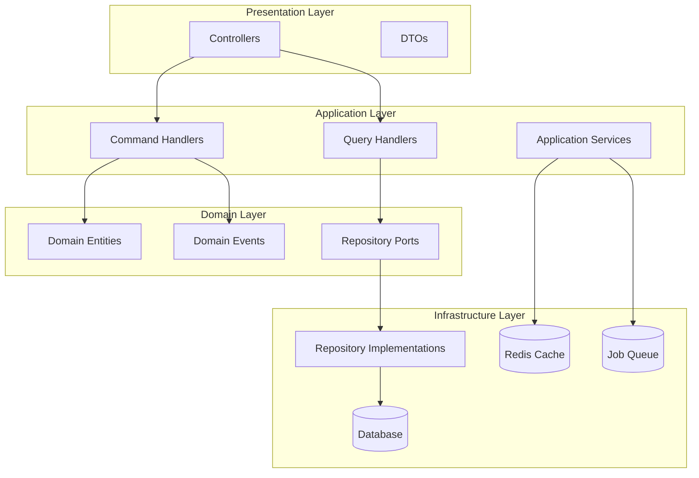
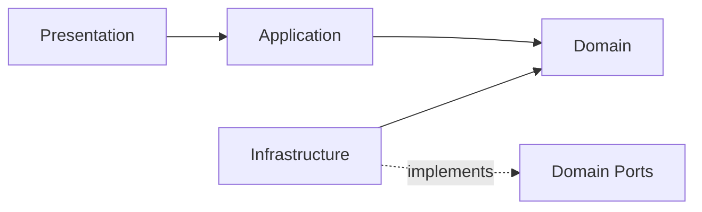

# Architecture Overview

## System Architecture

This application follows a **Modular Layered Architecture** with **Domain-Driven Design (DDD)** principles.



## Layer Responsibilities

### Presentation Layer (`presentation/`)

- **Controllers**: Handle HTTP requests and responses
- **DTOs**: Data Transfer Objects for request/response validation
- **Responsibilities**:
  - Request validation
  - Response formatting
  - HTTP concerns (status codes, headers)

### Application Layer (`application/`)

- **Command Handlers**: Execute write operations (CQRS)
- **Query Handlers**: Execute read operations (CQRS)
- **Services**: Orchestrate business logic
- **Responsibilities**:
  - Business workflow orchestration
  - Transaction management
  - Event publishing

### Domain Layer (`domain/`)

- **Entities**: Core business objects
- **Value Objects**: Immutable domain concepts
- **Domain Events**: Facts that occurred in the domain
- **Repository Ports**: Interfaces for data access
- **Responsibilities**:
  - Business rules enforcement
  - Domain logic
  - Domain invariants

### Infrastructure Layer (`infrastructure/`)

- **Repository Implementations**: Data access logic
- **External Services**: Third-party integrations
- **Responsibilities**:
  - Database operations
  - External API calls
  - File system operations

## Key Patterns

### CQRS (Command Query Responsibility Segregation)

Separates read and write operations for better scalability and maintainability.

**Commands** (Write Operations):

```typescript
// Command
export class CreateUserCommand {
  constructor(
    public readonly email: string,
    public readonly name?: string,
  ) {}
}

// Handler
@CommandHandler(CreateUserCommand)
export class CreateUserHandler implements ICommandHandler<CreateUserCommand, User> {
  async execute(command: CreateUserCommand): Promise<User> {
    // Business logic
    const user = await this.userRepository.create(command);
    this.eventBus.publish(new UserCreatedEvent(user.id));
    return user;
  }
}
```

**Queries** (Read Operations):

```typescript
// Query
export class GetUserByIdQuery {
  constructor(public readonly id: string) {}
}

// Handler
@QueryHandler(GetUserByIdQuery)
export class GetUserByIdHandler implements IQueryHandler<GetUserByIdQuery, User> {
  async execute(query: GetUserByIdQuery): Promise<User> {
    return this.userRepository.findById(query.id);
  }
}
```

### Repository Pattern

Abstracts data access behind interfaces (ports).

```typescript
// Port (Interface)
export interface UserRepository {
  create(data: CreateUserData): Promise<User>;
  findById(id: string): Promise<User | null>;
}

// Implementation
@Injectable()
export class UserRepositoryImpl implements UserRepository {
  async create(data: CreateUserData): Promise<User> {
    // Drizzle ORM implementation
  }
}
```

### Domain Events

Decouple modules through event-driven communication.

```typescript
// Event
export class UserCreatedEvent extends BaseDomainEvent {
  readonly eventType = 'user.created';

  constructor(public readonly userId: string) {
    super(userId);
  }
}

// Event Handler
@OnEvent('user.created')
async handleUserCreated(event: UserCreatedEvent) {
  // Send welcome email, create profile, etc.
}
```

## Module Structure

Each module follows this structure:

```
modules/
└── users/
    ├── domain/              # Domain layer
    │   ├── user.entity.ts
    │   └── events/
    ├── application/         # Application layer
    │   ├── commands/
    │   ├── queries/
    │   └── ports/
    ├── infrastructure/      # Infrastructure layer
    │   └── repositories/
    ├── presentation/        # Presentation layer
    │   ├── controllers/
    │   └── dtos/
    └── users.module.ts      # Module configuration
```

## Dependency Flow



**Key Principle**: Dependencies point inward. Domain layer has no dependencies on outer layers.

## Shared Kernel

Common utilities and base classes used across modules:

- **Domain**: Base entities, value objects, events
- **Infrastructure**: Database configuration, logging, caching
- **Application**: Common DTOs, filters, interceptors

## Configuration

Environment-based configuration using `@nestjs/config`:

```typescript
ConfigModule.forRoot({
  isGlobal: true,
  validate: validateEnv, // Zod schema validation
  cache: true,
});
```

## Error Handling

Centralized error handling with domain exceptions:

```typescript
// Domain Exception
throw new UserNotFoundException(userId);

// Global Exception Filter
@Catch()
export class AllExceptionsFilter implements ExceptionFilter {
  catch(exception: unknown, host: ArgumentsHost) {
    // Transform to RFC 7807 Problem Details
  }
}
```

## Next Steps

- [DDD Patterns Guide](./ddd-patterns.md)
- [Module Boundaries](./module-boundaries.md)
- [Testing Guide](./testing-guide.md)
